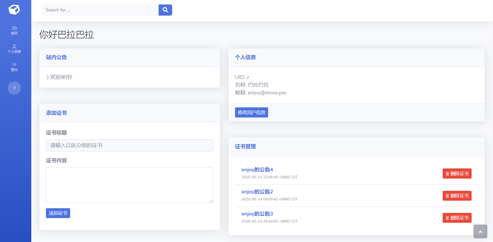

# coffee-keys-go
A Key Server, which can store and distribute public key safely and quickly.  
一个公钥服务器，可以安全、快速地存储和分发公钥。

使用GPL3.0开源协议

---
## 特点 👍
- 轻巧：Golang编写
- 快捷：无需繁琐的注册，开箱即用
- 安全：个人信息加密保存，防止 SQL 注入，并使用 [reCAPTCHA](https://www.google.com/recaptcha) 防止 CC 攻击
- 优美：界面采用 Bootstrap

## 环境要求 🌵
- **一个脑子**

## 用法  😋
1. 从 [Releases 页面](https://github.com/super-coffee/coffee-keys-go/releases) 下载最新版本的 Coffee Keys Go
2. 解压下载到的文件
3. 注册你的 [Google reCAPTCHA](https://www.google.com/recaptcha/admin) 密钥，将 database.sql 导入你的数据库
4. 修改你的config.template.json并且重命名为config.json
5. 运行 二进制程序
6. 访问 `your.domain`，查看效果

## 图片展示

